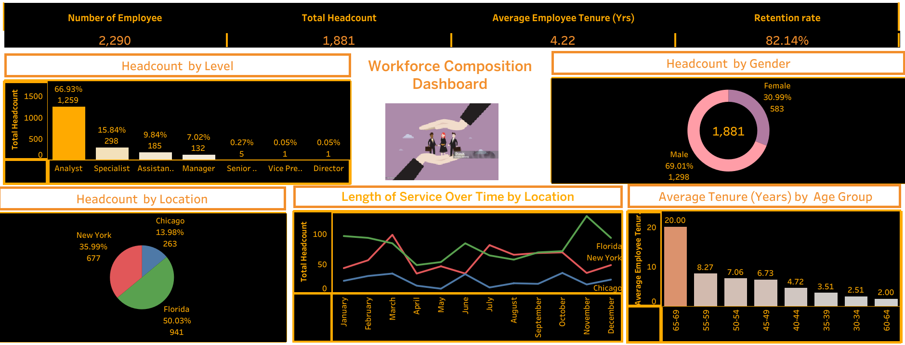

# HR-Analytics-Project


## Introduction:

With the background understanding that losing employees frequently influence the morale of the organization and hiring new employees is more expensive than keeping existing ones. Hence, this project focuses on data 

analysis of human resources. Different data management and analytics skills used to start from data acquisition from multiple HR sources, merging, exploring and deriving new features, building three dashboards to 

solve business questions to bring an actionable insight from the data to enhance potential retention strategy.

The three dashboards focus on:

 1 Workforce Composition Dashboard.

i.	Understand Workforce Demographics: This dashboard provides a clear picture of your team’s composition by visualizing key demographics such as age, gender, location, department, and job level.

ii.	Spot Representation Gaps: It highlights any imbalances in workforce representation across various categories, helping to inform and prioritize diversity, equity, and inclusion (DEI) efforts.

2. Employee Turnover Dashboard.
   
i.	Analyze Turnover Rates: Gain insights into overall and segmented turnover patterns across departments, locations, generations, and job levels to pinpoint areas needing attention.

ii.	Predict Future Trends: Leverage historical data to identify patterns and anticipate turnover trends, allowing for proactive workforce planning and intervention.

3.	Employee Satisfaction and Engagement Dashboard.
   
i.	Gauge Employee Sentiment: This dashboard captures how employees feel about critical areas like work-life balance, career growth, and job performance, making it easier to identify areas for improvement.

ii.	Foster a Positive Culture: By tracking engagement trends, you can implement strategies that enhance employee satisfaction, boost productivity, and strengthen retention efforts.

However it is assumed that survey cas carried out for members of the management staff.

**_Disclaimer: This project was created using a dataset from DataCamp, designed to support learning and skill development. The insights and findings are meant to showcase analytical techniques._**


## Problem Statement:

i.	Without a clear and detailed understanding of workforce demographics, the organization finds it difficult to identify gaps in representation across factors like age, gender, location, and job levels. This lack of 

insight hampers efforts to design and execute targeted diversity, equity, and inclusion (DEI) strategies.

ii.	The organization is unable to detect high turnover rates within specific departments, locations, or employee groups due to a lack of detailed tracking and forecasting. This gap in analysis prevents the business 

from addressing root causes and implementing effective retention measures.

iii.	Limited insight into employee satisfaction and engagement—particularly in areas like work-life balance, career development, and performance feedback—makes it difficult for the organization to act on employee 

concerns. This results in lower morale, reduced efficiency, and higher attrition rates.

## Data Description and Preparation:

The datasets were obtained from three different excel sheets in .csv extension which were named as follows and their fields included: 

i.	Org.csv sheet (14 columns 2291 rows) with variables (emp_id, status, turnover, location, level, date_of_joining, date_of_birth, last_working_date, gender, department, mgr_id, cutoff_date, generation, emp_age)

ii.	Survey.csv( 5 columns 350 rows) sheet having fields (mgr_id, mgr_effectiveness, career_satisfaction, perf_satisfaction, work_satisfaction)

iii.	Rating.csv (2 columns 1954 eows) having fields ( emp_id, rating)

Postgresl was used to join clean and join the datasets using the appropriate primary keys.

### SQL Process for Cleaning and Combining The Three Tables

```SQL CODES:
-- Cleaning the hr_data1 table to prepare employee information for analysis1
SELECT 
    emp_id,                                                -- Employee ID
    status,                                                -- Employment status (active, terminated, etc.)
    turnover,                                              -- Turnover indicator (e.g., 1 for left, 0 for active)
    location,                                              -- Location of the employee
    level,                                                 -- Job level or position in the organization
    date_of_joining,                                       -- Date the employee joined the organization
    date_of_birth,                                         -- Employee's date of birth
    COALESCE(last_working_date, '2014-02-07'::date) AS last_working_date,  -- Last working date; defaults to '2014-02-07' if NULL
    gender,                                                -- Gender of the employee
    department,                                            -- Department in which the employee works
    mgr_id,                                                -- Manager ID (reports to)
    cutoff_date,                                           -- Date up to which data is considered
    generation,                                            -- Generation category (e.g., Millennial, Gen Z)
    ROUND(emp_age::numeric, 2) AS emp_age                  -- Employee age, rounded to 2 decimal places
FROM 
    hr_data1;                                              -- Source table for employee data
```
```SQL CODES
SELECT 
    emp_id,                                                -- Employee ID
    status,                                                -- Employment status (active, terminated, etc.)
    turnover,                                              -- Turnover indicator (e.g., 1 for left, 0 for active)
    location,                                              -- Location of the employee
    level,                                                 -- Job level or position in the organization
    date_of_joining,                                       -- Date the employee joined the organization
    date_of_birth,                                         -- Employee's date of birth
    COALESCE(last_working_date, '2014-02-07'::date) AS last_working_date,  -- Last working date; defaults to '2014-02-07' if NULL
    gender,                                                -- Gender of the employee
    department,                                            -- Department in which the employee works
    mgr_id,                                                -- Manager ID (reports to)
    cutoff_date,                                           -- Date up to which data is considered
    generation,                                            -- Generation category (e.g., Millennial, Gen Z)
    ROUND(emp_age::numeric, 2) AS emp_age                  -- Employee age, rounded to 2 decimal places
FROM 
    hr_data1;     
```
```SQL CODES
-- Joining the tables (hr_cleaned_data, rating_cleaned, survey_cleaned) 
-- on primary keys (emp_id and mgr_id) to obtain comprehensive employee data
SELECT 
    h.emp_id,                  -- Employee ID
    h.status,                  -- Employment status (e.g., active, terminated)
    h.turnover,                -- Turnover status
    h.location,                -- Employee location
    h.level,                   -- Employment level (e.g., senior, junior)
    h.date_of_joining,         -- Date the employee joined the company
    h.date_of_birth,           -- Date of birth of the employee
    h.last_working_date,       -- Last working date if applicable
    h.gender,                  -- Gender of the employee
    h.department,              -- Department name
    h.mgr_id,                  -- Manager ID
    h.cutoff_date,             -- Cutoff date for data capture
    h.generation,              -- Generation category (e.g., Gen Z, Millennial)
    h.emp_age,                 -- Employee age
    s.mgr_effectiveness,       -- Manager's effectiveness rating from survey
    s.career_satisfaction,     -- Employee's career satisfaction score
    s.perf_satisfaction,       -- Employee's performance satisfaction score
    s.work_satisfaction,       -- Employee's work satisfaction score
    r.rating                   -- Overall employee rating
FROM 
    survey_cleaned AS s        -- Survey data table with manager effectiveness and satisfaction scores
INNER JOIN
    hr_cleaned_data AS h       -- HR data table with employee demographics and employment details
ON 
    s.mgr_id = h.mgr_id        -- Joining survey and HR data on manager ID (mgr_id)

INNER JOIN 
    rating_cleaned AS r        -- Rating data table with overall ratings for each employee
ON 
    h.emp_id = r.emp_id;       -- Joining HR and rating data on employee ID (emp_id)
```

### Feature Engineering:

Data in each excel sheet was efficiently cleaned in Postgresql and several data aggregations were performed and generated using Tableau in line with the business questions at hand to be answered:

These are listed below:
i.	Tenure	

ii. Avg. Tenure	

iii. Turnover Count	

iv. Turnover Rate	

v. Headcount 	

vi. Retention Rate	

vii. Age	 

viii. Duration of Employee Tenure

viii. Age Group

### Skills/Cobcept Demostrated:

Here’s a comprehensive breakdown of technical skills displayed in this scenario, categorized by key areas:

i.	SQL & Database Management
- Writing complex SQL queries
- Performing data cleaning with SQL
- Implementing table joins
- Creating derived columns and calculated fields in SQL.
- Designing and implementing relational database models (primary/foreign keys).
- Loading and managing datasets in PostgreSQL.

ii.	Data Preparation
- Data wrangling for consistency and readiness.
- Handling missing data and outliers.
- Data normalization and aggregation.
- Designing logical data models for analysis.
  
iii. Data Visualization & Analysis
- Connecting Tableau to PostgreSQL databases.
- Creating calculated fields and hierarchies in Tableau.
- Designing dashboards with interactive filters, tooltips, and drill-downs.
- Selecting appropriate chart types:
- Formatting visualizations for clarity and impact.
- Using KPIs to summarize performance metrics.

iv.	Insight Generation
- Analyzing trends, patterns, and outliers.
- Identifying actionable insights from visualizations.
- Using data to answer business questions and solve problems.
- 
v. Reporting & Storytelling
- Writing clear, concise, and professional reports.
- Summarizing key insights and recommendations.
- Structuring findings to align with business objectives.
- Presenting insights effectively to stakeholders.

vi.	Additional Technical Skills
- Data modeling and schema design.
- Creating and managing relationships between datasets.
- Proficiency in tools: PostgreSQL and Tableau.

## Explore the Dashboards

Dive into these interactive **HR Tableau Dashboards** to explore key insights into workforce composition, employee turnover, and satisfaction and engagement metrics.

### 1. Workforce Composition Dashboard
Understand the distribution of employees across departments, levels, and locations.

[](https://public.tableau.com/views/WorkforceCompositionDashboard3/Dashboard2?:language=en-US&:sid=&:redirect=auth&:display_count=n&:origin=viz_share_link)

---

### 2. Employee Turnover Dashboard
Analyze turnover trends and patterns by department, generation, and time period.

[](https://public.tableau.com/views/EmployeeTurnoverDashboard_17315162200460/Dashboard1?:language=en-US&:sid=&:redirect=auth&:display_count=n&:origin=viz_share_link)

---

### 3. Employee Satisfaction and Engagement Dashboard
Explore insights into employee satisfaction, engagement levels, and career satisfaction metrics.

[](https://public.tableau.com/views/EmployeeSatisfactionandEngagementDashboard4/Dashboard1?:language=en-GB&:sid=&:redirect=auth&:display_count=n&:origin=viz_share_link)

## ANALYSIS:

**Image of Workforce Composition Dashboard**



### Workforce Composition:

Findings:
1. Retention Patterns by Demographics:
The overall retention rate is 82.14%. Analysts have the highest retention rate (66.93%), and males have the highest retention rate (69.01%) among gender categories.
Staff aged 65 and above show the highest retention rate compared to other age groups.
2. Tenure and Location Insights:
Average tenure across the organization is 4.23 years.
Staff in Florida have the longest length of service, indicating better engagement and stability in this location.

**Image of Employee Turnover**


### Employee Turnover:

Findings:
1. High Turnover Among Millennials and Analysts:
Millennials exhibit the highest turnover rate (90.95%), and Analysts have the highest turnover among roles (84.11%).
2. Geographic and Demographic Trends:
Chicago has the highest location-based turnover rate (32.56%), while Florida has the lowest (10.55%). Male staff turnover (69.68%) significantly surpasses female turnover (30.32%).

**Image of Employee Satisfaction and Engagement**  


### Employee Satisfaction & Engagement:

Findings:
1. Role and Location Satisfaction:
Analysts in Florida report the highest job satisfaction, followed by those in New York. Career satisfaction in Florida, Chicago, and New York is positively correlated with manager effectiveness.
2. Generational Performance Trends:
Millennials show the highest performance satisfaction across locations, and Analysts in this generation report the highest work satisfaction (74.93%).

### Conclusions
**Demographic Gaps in Workforce Composition:**-
- The workforce shows clear imbalances in age, gender, and departmental representation. For example, certain groups—like younger employees or women in leadership—appear underrepresented. This imbalance can stifle diverse perspectives, limit innovation, and hinder an inclusive work culture.

**Turnover Trends Are Concentrated:**
- High turnover is not evenly spread but concentrated in specific departments, roles, and demographic groups. Early-career professionals and frontline roles seem particularly vulnerable. Turnover spikes during certain months, hinting that factors like performance reviews, workload pressures, or compensation decisions may play a role.

**Employee Satisfaction Influences Retention:**
Departments with low satisfaction scores—particularly in areas like work-life balance, career growth, and managerial support—face higher turnover. Younger employees, in particular, express dissatisfaction, signaling that unmet career expectations may be driving them away.

**The Role of Managers in Engagement:**
A consistent pattern emerges: employees with low managerial support are less satisfied and more likely to leave. Managers play a pivotal role in creating a supportive work environment, and their effectiveness directly impacts team morale and productivity.

### Recommendations

**Build a More Diverse and Inclusive Workforce:**
- To address workforce imbalances, focus on improving representation across all demographics. Start with targeted hiring strategies for underrepresented groups, and encourage internal career mobility to break barriers. Providing DEI-focused training to leadership can help embed a culture where every employee feels valued and heard.

**Tackle High Turnover with Targeted Interventions:**
- **Pinpoint departments and roles with the highest turnover and introduce tailored solutions, like mentoring for early-career professionals, competitive pay reviews, and work flexibility. Since turnover spikes during specific months, use proactive strategies such as aligning recognition programs or performance incentives to keep employees engaged during those critical times.

**Prioritize Career Growth and Employee Satisfaction:**
- Younger employees and others with limited growth opportunities need clear, structured career pathways. Offer regular check-ins, personalized development plans, and visible promotion opportunities. Pay special attention to work-life balance through policies like flexible scheduling, which can help address burnout.

**Strengthen Managerial Support and Effectiveness:**
- Managers must be equipped to lead effectively, as they are a linchpin in employee engagement. Invest in manager development programs that emphasize coaching, communication, and emotional intelligence. Regular feedback systems can also help managers stay connected with their teams’ needs and address issues before they escalate.


